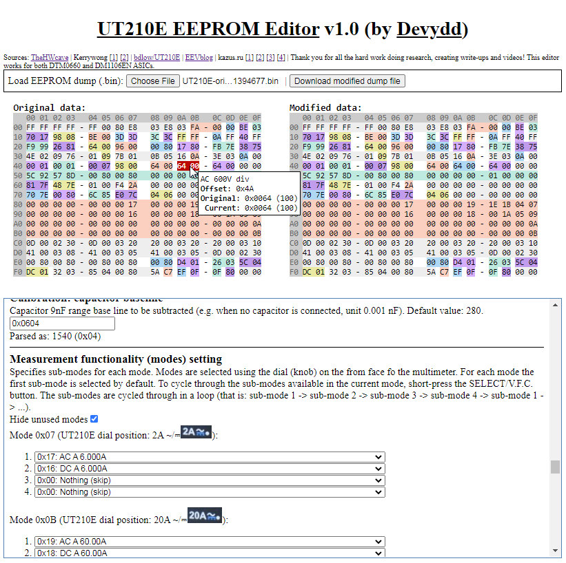

# UT210E EEPROM Editor (by Devydd)

UT210E EEPROM Editor written in client-side JavaScript embedded in a single HTML page, fully offline.

This editor works fully offline. You can download [the editor file](src/UT210E_EEPROM_editor.html) and open it in a browser from your computer (in a modern browser), no server is required.

You can also access this editor on-line from GitHub pages: https://devydd.github.io/UT210E-EEPROM-Editor/.

## Inner workings

This project was created to alleviate the pain of hand-editing the hex dump and to explore contemporary JavaScript syntax along with API supported by the modern Chrome browser (other browsers not tested - pull requests fixing possible issues are welcomed!).

Should you notice any errors, want to add missing range, update the description, etc. feel free to open an issue or submit a pull request.

It should be rather easy task to modify the source code to support any other `EEPROM` - the page is generated dynamically based on [the `bin_ranges` variable](https://github.com/devydd/UT210E-EEPROM-Editor/blob/87e555012c5713fddd55565a0c927f97bff5fb03/src/UT210E_EEPROM_editor.html#L223).